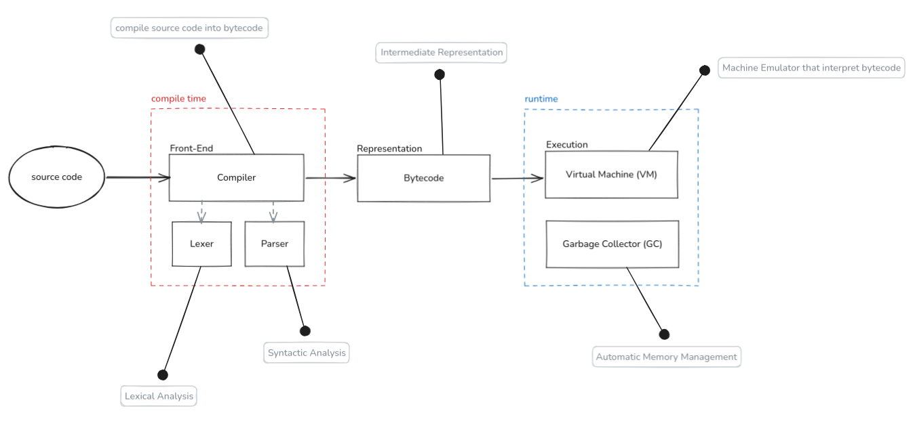

[](#)
[](https://choosealicense.com/licenses/mit/)
[](#)

A garbage-collected (GC), VM-based (bytecode interpreted) language.<br>

## Table of Contents
- [Ant language?](#-ant-language)
- [Features](#-features)
- [Ant Pipeline](#-ant-pipeline)
- [Build and Usage](#-build-and-usage)
- [Contributing](#-contributing)

## 📘 Ant language?
Ant is a new, open-source programming language. Its host-language is the C language.

Ant is an interpreted, dynamically typed & strongly typed, multi-paradigm language with its own bytecode-based Virtual Machine (VM) and an automatic Garbage Collector (GC) for memory management.

## ✨ Features
This open-source project is designed to be simple, portable, and efficient. It includes the following features:<br>
📄 Bytecode-based execution — source code is compiled into bytecode before execution<br>
📦 Portable bytecode — Ant bytecode is platform-independent<br>
🖥️ Virtual Machine (VM) — emulator that execute bytecode<br>
🧹 Garbage Collector (GC) — automatic memory managmenet for heap-allocated object<br>
🧩 Multi-paradigm — supports multiple programming style<br>
🌍 Cross-platform — designed to run across multiple operating systems and platforms<br>
🚀 Optimized runtime — designed for efficient bytecode execution and runtime performance<br>
⚡ Fast execution — focused on providing fast and efficient runtime performance<br>
📚 Ease-to learn and use — simple and expressive language design<br>
📖 Well documented — comprehensive documentation to help users learn and use Ant<br>

## ⚙ Ant Pipeline


## 🔨 Build and Usage

Ant uses **Make** as its build system.

Clone the repository and build Ant with:

```bash
make all
```

After building, you can run Ant in one of two modes:

### 💻 Interactive Mode

Start Ant without providing a script to enter **Interactive Mode**:

```bash
./ant
```

This mode allows you to write and execute Ant code directly in the terminal.

### 📜 Script Mode

To execute an Ant source file, pass the `.ant` script as an argument:

```bash
./ant <script-path>
```

## 🤝 Contributing
We welcome contributions, suggestions, and feedback! Whether it’s fixing bugs, implementing new features, optimizing performance, improving the runtime, or enhancing documentation, your help is greatly appreciated.